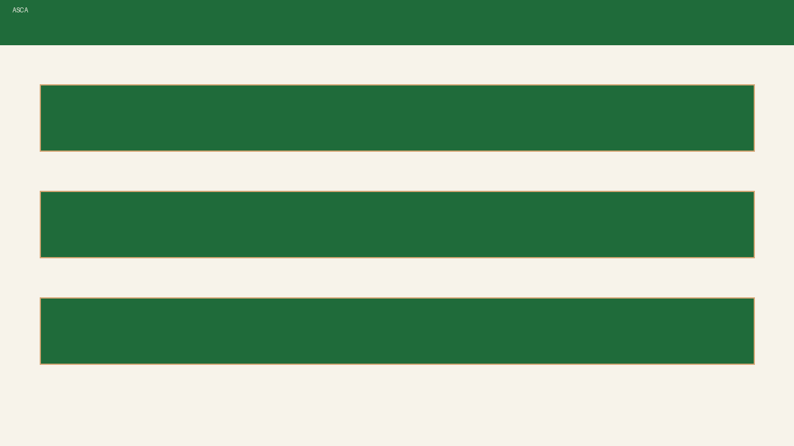
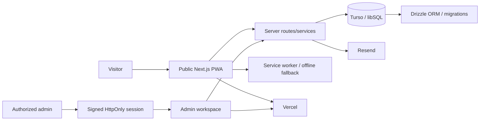

# Atlanta Saddle Club Association — PWA + Admin

A client-facing Progressive Web App and non-technical administration workspace for the **Atlanta Saddle Club Association (ASCA)**.

**Live deployment:** https://asca-pwa.vercel.app



> **Status:** Active client system. The public deployment returned HTTP 200 on **October 7, 2026**. A recent GitHub Actions end-to-end run passed on the `opee/admin-client-training` branch on September 28, 2026. Production behavior must still be reverified after consequential merges.

## Outcome

ASCA replaces scattered website maintenance and operational updates with one controlled system for public information and routine administration.

The product currently separates two concerns:

- **Public PWA** — Home, About, Meet ASCA, Get Involved, Event Calendar, Gallery, Horses, support/donation-oriented content.
- **Admin workspace** — people, events, messages, tasks, gallery/media, horse records, page images, appearance/settings, and guided support.

The current architecture is the code in this repository. Older phase, Supabase, MongoDB, Strapi, or earlier Next.js documents are historical unless explicitly marked current.

## Architecture



## Current stack

| Layer | Technology |
| --- | --- |
| Application | Next.js 15 App Router + React 18 + TypeScript |
| Styling | Tailwind CSS + ASCA design tokens |
| Data | Turso/libSQL + Drizzle ORM |
| Authentication | Signed admin sessions using HttpOnly cookies + server-side role checks |
| Email | Resend |
| PWA | Manifest + first-party service worker + offline fallback |
| Hosting | Vercel |
| Verification | Node service tests + Playwright E2E |
| Package manager | pnpm 11.8.0 |

## Product surfaces

### Public experience

The public application provides the member/visitor-facing experience and installable PWA shell.

### Admin experience

Primary client workflow:

- **Dashboard** — messages, tasks, events, members, recent activity
- **People** — contacts and member records
- **Operations** — events, messages, tasks
- **Website** — gallery albums, horses, images, appearance, social/donation settings
- **Support** — guided help and account settings

Migration/integrity tools are intentionally excluded from the primary navigation.

## Clean setup

1. Install Node.js 22 and pnpm 11.8.0.
2. Copy `.env.example` to `.env.local`.
3. Configure a development Turso/libSQL database and a strong `NEXTAUTH_SECRET`.
4. Install, migrate, and start:

```bash
pnpm install --frozen-lockfile
pnpm db:migrate
pnpm dev
```

## Quality gates

Before a consequential production merge:

```bash
pnpm type-check
pnpm lint
pnpm test
pnpm build
```

Pull requests can also run the Playwright workflow in `.github/workflows/e2e.yml`, which provisions a disposable local libSQL database and exercises authorization, integrity, migration/restore, service, and browser paths.

A deployment is **not** considered healthy only because Vercel reports READY. Verify the intended public route, admin authentication boundary, core admin workflow, and the relevant write path.

## Security

See [SECURITY.md](SECURITY.md).

Core rules:

- admin session tokens remain HttpOnly and are not stored in `localStorage`;
- server-side APIs enforce authorization; UI guards are not authorization;
- production auth fails closed when required signing configuration is absent/weak;
- public input is bounded and sanitized before persistence or email rendering;
- credentials and customer data do not belong in git history;
- destructive or state-changing admin work requires a live server response.

## PWA boundaries

- HTML, admin pages, APIs, and mutable content are network-first/no-store.
- Only truly immutable assets should use cache-first behavior.
- Admin routes are not offline-authoritative.
- Service-worker activation must not force-navigate every open client.
- The manifest should advertise only implemented capabilities.

## Deployment path

The repository is connected to the Vercel project `asca-pwa`.

Preferred release flow:

**branch → preview → CI/E2E → review → merge → production verification → evidence**

Client-facing or security-sensitive changes should not bypass these gates.

## Known limitations / boundaries

- Historical documents in the repository may describe retired architectures; README + executable code are authoritative.
- Email delivery requires valid external Resend configuration.
- A passing branch E2E run does not prove a later production deployment without post-merge verification.
- This is a client system, not a general-purpose open-source package. No open-source license is granted unless an explicit license file says otherwise.

## Business value

ASCA demonstrates delivery beyond a public website: **content operations, authenticated administration, persistent data, PWA behavior, recovery/migration tooling, and client-operable workflows** are integrated into one system.

---

**Maintained by Cod3Black Agency / wizelements**  
**Last portfolio verification:** October 7, 2026
